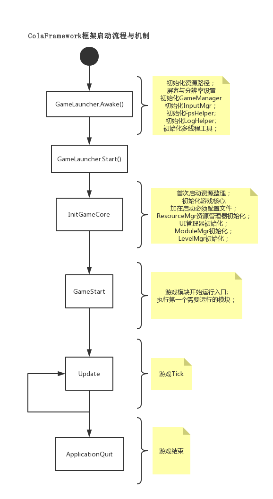
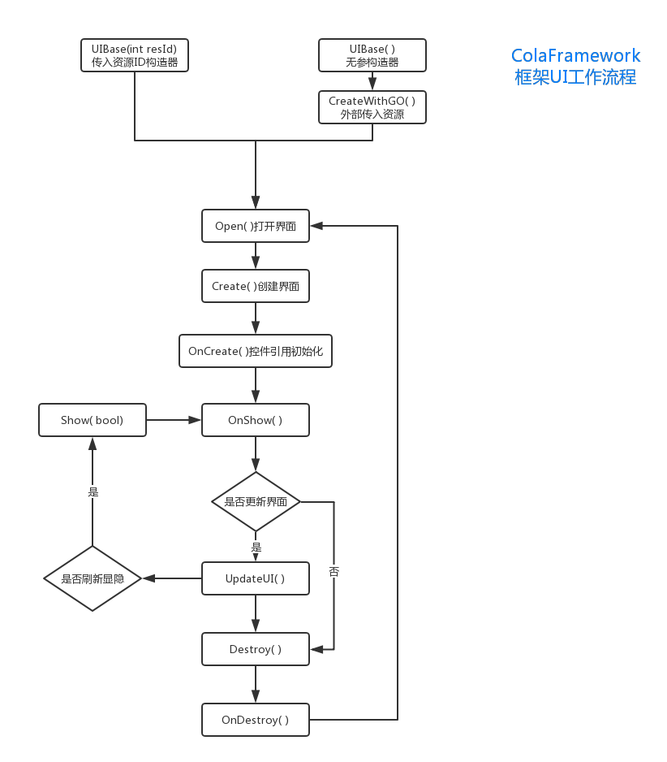
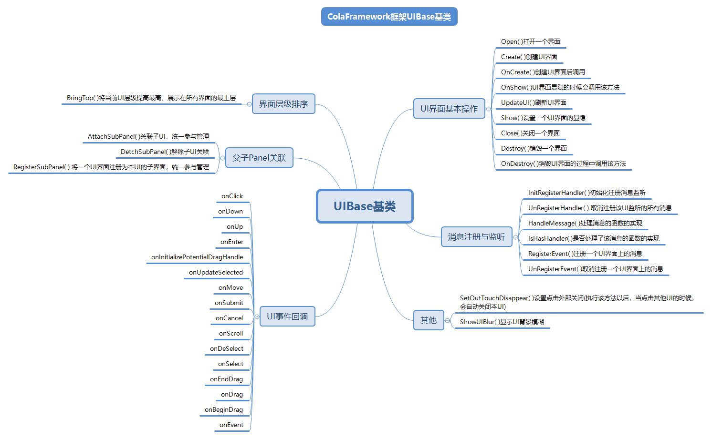

# ColaFrameWork  

### ColaFrameWork 自研Unity客户端框架  
架构阶段，暂时没有项目使用过。  

### 框架简介  
ColaFramework 一款简洁的MVC结构的Unity客户端框架，尤其支持快速开发3D战斗卡牌和mmo类型的游戏。目前暂时还不支持lua开发和热更，下一步准备完善这方面的内容，希望有兴趣的可以一起来维护。  
### 开发环境  
* Unity2018.2.3  
* VS2017  
* C# & Lua    

### 安装集成  
可以选择以下两种安装方式集成本框架：
* Clone本项目到本地，与自己的代码融合或者直接在框架基础上进行开发;  
* ~~下载插件包，导入到Unity工程以后进行开发。插件包下载地址：[ColaFramework_v0.0.1.unitypackge](https://pan.baidu.com/s/1kVLYH7IFP8bOmhDAWsY-wA)~~ （需要调整）

### 项目手册  

#### 项目结构  
  

#### 游戏启动运行流程与机制  

目前框架根据平台的不同，设计了不同的启动场景，分别命名为：  
>* GameLauncher(Windows平台)  
>* GameLauncherAndroid(Android平台)  

无论启动场景是哪一个，游戏都由GameLauncher启动器脚本启动。GameLauncher为一个单例类，在游戏初始化的过程中，启动器类负责初始化GameManager、InputMgr、FpsHelper、DebuglogHelper、U3DAutomation、StreamingAssetHelper、多线程工具类等一些基础的操作。  
在一些必要的资源准备妥当以后，会执行InitGameCore()方法，该方法会调用GameManager的InitGameCore()方法，进一步地进行初始化一些次要的管理器与资源。
在GameLauncher类中，会主动调用GameManager的Update、LateUpdate、FixedUpdate、ApplicationQuit等类似于MonoBehaivor中的方法，这让您依然可以自由地在这些方法中进行处理自己的相应逻辑。  

  
  

#### 数据节点管理   

* CSV&C#版数据节点管理  
策划使用Excel表进行数据的配置，然后通过[转表工具](https://github.com/XINCGer/Unity3DTraining/tree/master/XlsxTools/xls2csv)(位于ColaFrameWork\Tools\XlsxTools\xls2csv目录下，内有详细的使用指南)将Excel表转为csv结构的数据结构供客户端读取。  
每一份csv数据表，都应对应一个数据解析类以及一个数据集合类，其中数据解析类用于解析并存储csv中的单条数据（一行），数据集合类将存储多个数据解析类的对象。  
数据解析类都应继承自 **LocalDataBase** (本地数据表中的单条数据的抽象基类)：  
```C#
/// <summary>
/// 本地数据表中的单条数据的抽象基类
/// </summary>
public abstract class LocalDataBase
{
    /// <summary>
    /// ID
    /// </summary>
    public int id;

    /// <summary>
    /// 初始化数据
    /// </summary>
    /// <param name="strData"></param>
    public abstract void InitWithStr(string strData, char splitChar = ',');

    /// <summary>
    /// 得到Int数据
    /// </summary>
    /// <param name="str"></param>
    /// <returns></returns>
    protected int GetInt(string str)
    {
        if (!string.IsNullOrEmpty(str))
        {
            return int.Parse(str);
        }

        return 0;
    }

    /// <summary>
    /// 得到float数据
    /// </summary>
    /// <param name="str"></param>
    /// <returns></returns>
    protected float GetFloat(string str)
    {
        if (!string.IsNullOrEmpty(str))
        {
            return float.Parse(str);
        }

        return 0;
    }

    /// <summary>
    /// 得到bool数据
    /// </summary>
    /// <param name="str"></param>
    /// <returns></returns>
    protected bool GetBool(string str)
    {
        if (!string.IsNullOrEmpty(str))
        {
            return bool.Parse(str);
        }

        return false;
    }
}

```
**LocalDataBase** 该抽象类提供了一些基本的数据类型转换方法，id字段用来存储索引id，InitWithStr接口用来解析数据，将数据表中的单行文本传入到该接口以后，通过splitChar标识将数据进行拆分、解析。框架中已经包含了**I18NData**解析类，编写其他数据解析类时可以参考此类。  
数据集合类都应实现 **ILocalDataMapBase** 接口(DataMap，数据集合的接口，实现该接口用于管理LocalDataBase)  
```C#
/// <summary>
/// DataMap，数据集合的接口，实现该接口用于管理LocalDataBase
/// </summary>
public interface ILocalDataMapBase
{
    /// <summary>
    /// 对多行字符串进行处理，保存成LocalDataBase集合
    /// </summary>
    /// <param name="rows"></param>
    void SetMapCsv(string[] rows);
}
```  
**ILocalDataMapBase** 接口内只有一个 **void SetMapCsv(string[] rows)** 抽象方法，该方法用来对多行字符串进行处理，保存成LocalDataBase集合。
框架中已经包含了**I18NDataMap**数据集合类，编写其他数据集合类时可以参考此类。  

* LuaConfig&Lua版数据结构管理  

同样本框架也支持将Excel表格数据转为lua形式的配置文件，这样便于接入Lua开发以后数据的访问，提高访问效率。  
Lua格式的转表工具位于[Lua转表工具](./Tools/XlsxTools/xls2lua),其中config配置文件用来配置原始数据的目录和导出的Lua配置文件的目录
如果没有特殊需求的话，无需变更配置文件，直接执行同级目录下的Xls2Lua.exe工具即可进行转表操作。  
可以通过 configMgr:GetConfig(name) 方法获取到对应表格的全部配置数据。通过ConfigMgr:GetItem(name,id)可以获取到对应表格的指定id的数据，ConfigMgr在数据加载与读取过程中做了懒加载的缓存策略，在尽可能节省空间的情况下提高数据加载与读取的速度。  
#### 事件/消息处理中心(Controller层)    
框架支持C#版和Lua版两套消息监听与派发机制，用来充当普通的Controller层，用于V和M的解耦等操作。具体的实现原理和用法可以看以下这篇博客：  
[【Unity游戏开发】用C#和Lua实现Unity中的事件分发机制EventDispatcher](https://www.cnblogs.com/msxh/p/9539231.html)  

#### UI框架(View层)   
* UI工作流程  
  
* UI主要方法  
  

#### SubSys系统框架(Module层)  
Module的基类为ModuleBase，游戏内所有的系统的业务逻辑层均继承自该类。框架采用厚Module类型的MVC结构，弱化了C层的作用，强化了M层。游戏中的业务逻辑大部分都放在M层进行处理处理。M层负责处理业务逻辑、监听网络消息、请求网络消息、派发事件通知其他模块或者UI等更新。M层不应该了解View层的存在，不可以直接调用View层，应该通过消息机制通知View做出动作。

#### 组件与实体获取  
ColaFrameWork框架中支持三种获取组件或者Gameobject等其他实体的方式，分别为传统直接获取式、AutoInject依赖注入式和自动查找序列化三种，下面详细介绍一下区别与使用：  

#### Execl策划表格规范与转表  

待补充  

#### 资源管理  

待补充  

#### 编辑器拓展与工具  
待补充  

#### 游戏自动化测试  
框架中集成了WETEST_SDK，通过使用[GAutomator](https://github.com/Tencent/GAutomator)实现Unity手游的UI自动化测试。  

#### DebugLog与日志  
待补充  

#### 网络通信与协议  
待补充  

#### 寻路系统  
ColaFramework框架目前集成了AStar、Recast两种寻路系统。  

#### 插值动画/缓动动画  
ColaFramework框架集成了DoTween、iTween两款比较常见的插值动画/缓动动画插件，并且自己拓展封装了适合UGUI的UGUITween组件，可以像NGUI中的Tween一样使用，非常方便，用来解决一些简单的Tween动画效果再合适不过了。  
其中拓展UGUITween组件包含以下几个常用的Tween组件：  
>* UGUITweenScale  
>* UGUITweenPosition  
>* UGUITweenAlpha  
>* UGUITweenRotation  


